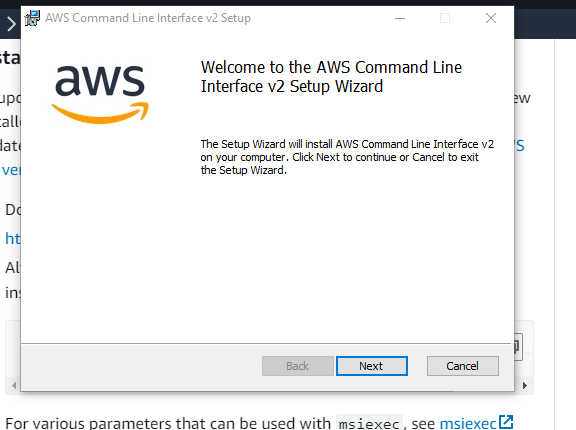
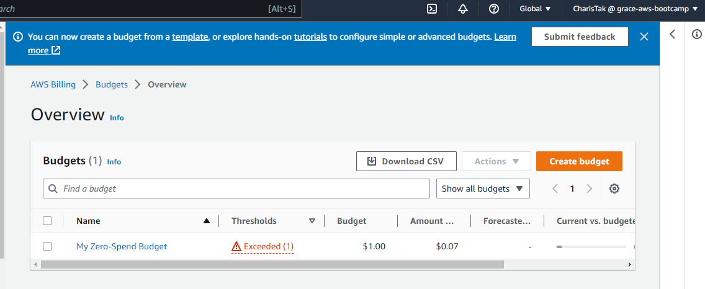

# Week 0 — Billing and Architecture

##Required Homework

### Installing and Verify AWS CLI

I was not able to install aws cli due to gitpod browser issues.
Below the intructions I used for isntalling it on Windows.

Installed AWS CLI on Windows  via **command promt**

Followed the instructions on [AWS CLI Install Documenttion Page](https://docs.aws.amazon.com/cli/latest/userguide/getting-started-install.html)





```
msiexec.exe /i https://awscli.amazonaws.com/AWSCLIV2.msi
```

```
C:\Users\haris>aws --version
aws-cli/2.10.1 Python/3.9.11 Windows/10 exe/AMD64 prompt/off

```


### Create a Budget Alarm

I created a 1$ dollar alarm because I can't afford any spend.
I did not create a second budget due to 2  budget free limit.



### Recreate Logical Architecture Design


